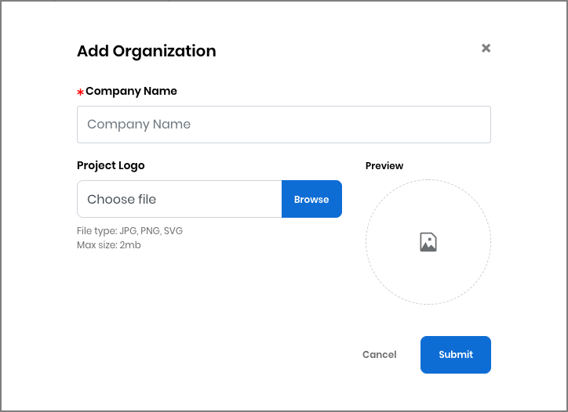

# Docs Source : .Add, Edit, or Delete an Organization vInitial

You can add, edit, or delete an organization to sponsor a fund on behalf of the organization.

## Add an Organization 

1. Click **+ Add Organization.** The Add Organization dialog appears.  
2. Complete the dialog fields and click **Submit.**   You are returned to the New Donation dialog. The organization is pending review by Linux Foundation.   **Note:** After your organization is approved by Linux Foundation, you can see the name in the list.  
3. Click **Edit** if you want to edit or delete the organization.

## Edit or Delete an Organization 

Only the person who added the organization can edit or delete it.

1. From the list of organizations that you have added, select an organization that you want to edit or delete, then click **Edit**. The Edit Organization dialog appears.    
2. Edit the dialog fields to update the organization and click **Submit**, or click **Delete** to delete the organization.

