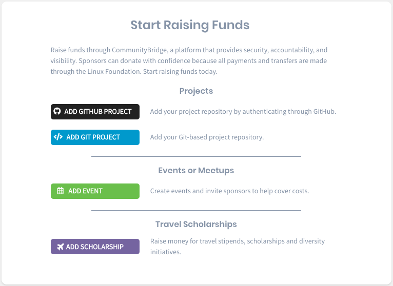

# Docs Source : .Apply for Funding vInitial

You can submit an application to add your project and receive financial support from organizations and individuals to grow your community through a streamlined, automated funding workflow and a transparent, easy-to-use ledger. Adding your project to CommunityBridge Funding can:

* Attract funding by publicizing funding goals and allocations
* Keep more money by paying no platform or processing fees \(up to $10M in raised funds per project\)
* Reduce busywork by offloading administrative overhead \(like invoices and tax paperwork\) and streamlining your workflow
* Increase trust by using a transparent, easy-to-use ledger and an audited, non-profit foundation as your fiscal sponsor
* Increase adoption of your project by paying for expenses such as for developers, events, or infrastructure

## Submission Guidelines 

Consider the following submission guidelines before you apply:

* GitHub Project and Git Project:
  * Your project is 100% open source, has more than one active contributor, and is not backed solely by a single company
  * Your project has at least 100 stars on GitHub \(or a comparable rating on other Git-based sources\)
  * You own the public Git-based repository
  * You are responsible for project communications
  * You will be responsible for managing payments from project funds
  * You can determine fundraising goals
* Events and Travel Scholarships:
  * You are responsible for the fund communications
  * You will be responsible for managing payments from the funds
  * You can determine fundraising goals

## Submit an Application 

Follow the steps to submit an application for adding an open source project or other fund to CommunityBridge Funding.

**Note:** The application includes information about yourself and your project; only provide this information if you are authorized to accept the CommunityBridge Platform Use Agreement on behalf of your project.

**Do these steps:**

1. Log in to [CommunityBridge Funding](https://funding.communitybridge.org/). For more details, see [2019-11-04\_08-00-05\_Log In to CommunityBridge Funding](/pages/createpage.action?spaceKey=PROD&title=2019-11-04_08-00-05_Log+In+to+CommunityBridge+Funding&linkCreation=true&fromPageId=4821860)  
2. Click **Apply** and then select an **option**.    
3. Submit an application: [Add a GitHub Project](docs-source-.add-a-github-project-vinitial.md) [Add a Git Project](docs-source-.add-a-git-project-vinitial.md) [Add an Event](docs-source-.add-an-event-vinitial.md) [Add a Scholarship](docs-source-.add-a-scholarship-vinitial.md)

## Your Activities 

After your project is approved, you do the following ongoing activity:

### [Manage Your Funding Account](docs-source-.manage-your-funding-account-vinitial.md) 

