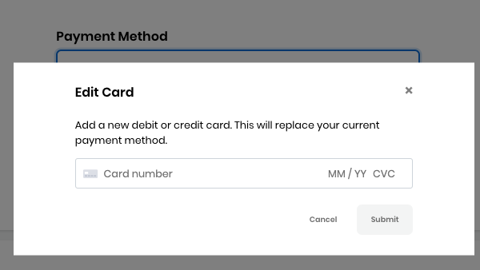

# Docs Source : .Donate to a Project as an Individual vFuture

As an individual, you donate a minimum of $5.00 and no maximum amount. While donating to a project, specify how you want your donations to be used and track expenses in transparent public ledgers.

**Do these steps:**

1. Open [CommunityBridge Funding](https://funding.communitybridge.org). Projects appear in alphabetical order.
2. Click **Donate** on a project of interest. You are prompted to log in if you have not already done so. The New Donation form appears and lists the organizations that are associated with your project. 
3. Select **Individual**. The **I want to give** options show preset amounts for individual donor or backer.
4. Select a preset amount or click in the **I want to give** field and type a dollar amount.
5. Select a donation frequency option: One-time or Monthly.
   * If you choose to donate on a monthly basis, you will be billed on a recurring basis that is on the first calendar day of each month. 
   * You can cancel your recurring donation by logging into your account and changing your donation settings or by contacting us at [admin@communitybridge.org](mailto:admin@communitybridge.org).
6. Recurring donations...

   If you choose to donate on a monthly basis, you will be billed upon submitting the donation, and will continue to be billed on the first calendar day of each subsequent month thereafter, until you choose to stop the recurring donation. By electing to donate on a recurring basis, you acknowledge that your donation will automatically renew and have a recurring payment feature, and that unless and until you opt out of the auto-renewal of the recurring donation, which can be done through the CommunityBridge Funding service, any recurring donation you have signed up for will be automatically renewed for successive renewal periods of the same duration as the initial term originally selected. You can cancel your recurring donation by logging into your account and changing your donation settings or by contacting us at [admin@communitybridge.org](mailto:admin@communitybridge.org).

7. \(Optional\) In the **Donation allocation** drop-down list, select a project goal for your donation to support.  **Note:** The project maintainers can adjust fund allocations as per their choice, and may not use the funds per your requested allocation. If you have a strict fund allocation target, please contact your Linux Foundation administrator.
8. **Credit or debit card** lets you add a default card or edit a default card to use for your donation payment. Click **Add Card** or **Edit Card** to add or edit a card, respectively. Enter your card details and click **Submit**.  
9. Review your donation summary and your donation amounts in the **Review Donation** section. Notice the fee amounts and the amount that the Linux Foundation waives.
10. Select the checkbox—**I agree to the CommunityBridge** [**Platform Use Agreement**](https://communitybridge.org/platform-use-agreement) **and all terms incorporated therein, including the** [**Service-Specific Use Terms**](https://communitybridge.org/service-terms)**, the** [**Acceptable Use Policy** ](https://communitybridge.org/acceptable-use)**and the** [**Privacy Policy**](https://www.linuxfoundation.org/privacy/) ****Checkbox.
11.  Click **Submit Donation** or **Submit Subscription** \(the button changes dynamically depending on your donation type\). **Result:** Your Accounts page appears. At any time, you can go to your user account  and select **My Transactions** to edit your monthly donation amount—click **Edit monthly donation** on the project of interest.

