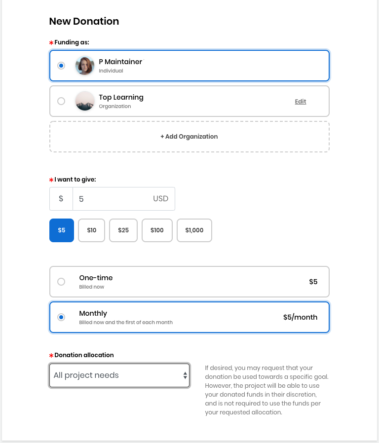

# Docs Source : .Donate to a Project as an Individual vInitial

As an Individual, you can donate a minimum of $5. When donating to a project, you may request that your donation is used towards all project needs or a mentorship funding goal.

**Do these steps:**

1.  [Log in](https://docs.linuxfoundation.org/display/PROD/.Login+to+CommunityBridge+vInitial) to [CommunityBridge Funding](https://funding.communitybridge.org). Projects appear in alphabetical order.  
2. Click **Donate** on a project card. **Note:** If you click **Donate** on a project card on the CommunityBridge Mentorship section, you will be re-directed to the CommunityBridge Funding section and the New Donation form appears.     
3. Select **Individual**. The **I want to give** options show preset amounts for individual donor.  
4. Select a preset amount or click in the **I want to give** field and type in a dollar amount.  
5. Select a donation frequency option: **One-time** or **Monthly**.
   * If you select **Monthly**, you will be billed on a recurring basis that is on the first calendar day of each month.
   * You can cancel your recurring donation by logging into your account and changing your donation settings or by contacting [admin@communitybridge.org](mailto:admin@communitybridge.org).
6. In the **Donation allocation** drop-down list, select a project goal for your donation to support, for example you can select **Mentorship** if you want to donate only towards the mentorship program of a project. **Note:** The project maintainers can adjust fund allocations and may not use the funds per requested allocation. If you have a strict fund allocation target, please contact your Linux Foundation administrator.  
7. **Credit or debit card** lets you add a default card or edit a default card to use for your donation payment. Click **Add Card** or **Edit Card** to add or edit a card, respectively. Enter your card details and click **Submit**.     
8. Review your donation summary and your donation amounts in the **Review Donation** section. Notice the fee amounts and the amount that the Linux Foundation waives.  
9. Select the checkbox— **I agree to the CommunityBridge** [**Platform Use Agreement**](https://communitybridge.org/platform-use-agreement) **and all terms incorporated therein, including the** [**Service-Specific Use Terms**](https://communitybridge.org/service-terms)**, the** [**Acceptable Use Policy** ](https://communitybridge.org/acceptable-use)**and the** [**Privacy Policy**](https://www.linuxfoundation.org/privacy/).  
10.  Click **Submit Donation** or **Submit Subscription** \(the button changes based on your choice from donation type\). **Result:** Your Accounts page appears.At any time, you can [Log in](https://docs.linuxfoundation.org/display/PROD/.Login+to+CommunityBridge+vInitial) to [CommunityBridge Funding](https://funding.communitybridge.org), go to your user account  and select **My Transactions** to edit your monthly donation amount—click **Edit monthly donation** on the project of interest.

