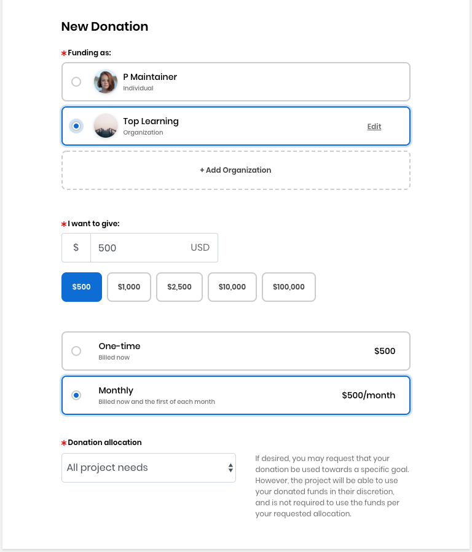

# Docs Source : .Donate to a Project as an Organization vInitial

Organizations or companies donate a minimum of $500. While donating as an organization, specify how you want your donations to be used and track expenses in transparent public ledgers. When you donate on behalf of an organization \(rather than in your personal capacity\), you must be authorized by that organization to do so.

**Note:** Organizations making one-time donations may request an invoice to make their donation. All other donations must be made by credit or debit card.

Keep these items ready before you begin:

* A logo file for your organization in JPG, PNG, SVG format with a maximum size of 2 MB
* If you are making a payment using an invoice, information such as account and routing numbers

**Do these steps:**

1.  [Log in](https://docs.linuxfoundation.org/display/PROD/.Login+to+CommunityBridge+vInitial) to [CommunityBridge Funding](https://funding.communitybridge.org/). Projects appear in alphabetical order.  
2. Click **Donate** on a project of interest. **Note:** If you click **Donate** on a project using the CommunityBridge Mentorship website, you are re-directed to the CommunityBridge Funding website. The New Donation form appears and lists the organizations that are associated with your project.     
3. Select an **organization.** If you do not see an organization name, Click **+Add Organization**. For details, see [Add, Edit, or Delete an Organization.](docs-source-.add-edit-or-delete-an-organization-vinitial.md)  ****
4. Select a **preset amount** or click in the **I want to give** field and enter a dollar amount.  
5. Select a donation frequency option: **One-time** or **Monthly**.
   * If you select **Monthly**, you will be billed on a recurring basis that is on the first calendar day of each month. You can cancel your recurring donation by logging into your account and changing your donation settings or by contacting [admin@communitybridge.org](mailto:admin@communitybridge.org).
   * The **Invoice** option under Payment Method is disabled if you select **Monthly.** You can request for an Invoice if you select **One-time**.
6. In the **Donation allocation** drop-down list, select a project goal for your donation to support, for example you can select **Mentorship** if you want to donate only towards the mentorship program of a project. **Note:** The project maintainers can adjust fund allocations as per their choice, and may not use the funds per your requested allocation. If you have a strict fund allocation target, please contact your Linux Foundation administrator.  
7. For Payment Method, select an option:
   * **Credit or debit card** lets you add a default card or edit a default card to use for your donation payment. Click **Add Card** or **Edit Card** to add or edit a card, respectively. Enter your card details and click **Submit**.
   * **Invoice** lets you request an invoice from the Linux Foundation for your donation. Select **Invoice**. If you have a purchase order number, enter the number in the PO Number field that appears. If you want to request a purchase order number, contact your Linux Foundation administrator—the Finance team will contact you. The Finance team can work with your organization for other methods of payment such as checks.  
8. Review your donation amounts in the **Review Donation** section. Notice the fee amounts and the amount that Linux Foundation waives.  
9. Select the checkbox— **I agree to the CommunityBridge** [**Platform Use Agreement**](https://communitybridge.dev.platform.linuxfoundation.org/platform-use-agreement) **and all terms incorporated therein, including the** [**Service-Specific Use Terms**](https://communitybridge.dev.platform.linuxfoundation.org/service-terms)**, the** [**Acceptable Use Policy** ](https://communitybridge.dev.platform.linuxfoundation.org/acceptable-use)**and the** [**Privacy Policy**](https://www.linuxfoundation.org/privacy/).  
10.  Click **Submit Donation** or **Submit Subscription** \(the button changes dynamically depending on your donation type\). **Result:** Your Accounts page appears. At any time, you can [Log in](https://docs.linuxfoundation.org/display/PROD/.Login+to+CommunityBridge+vInitial) to [CommunityBridge Funding](https://funding.communitybridge.org/), navigate to your user account  and select **My Transactions**  to edit your monthly donation amount—click **Edit monthly donation** on the project of interest.

