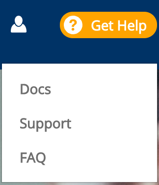

# Docs Source : .Funding - Get Help vInitial

**Do these steps:**

1. Go to **Get Help**.
2. Select an **option** from the drop-down list.  **Docs** opens the Linux Foundation Product Documentation. **Support** opens the Help Center. **FAQ** opens the Funding FAQs.

