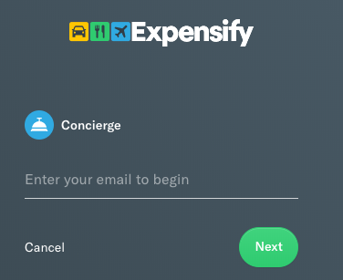
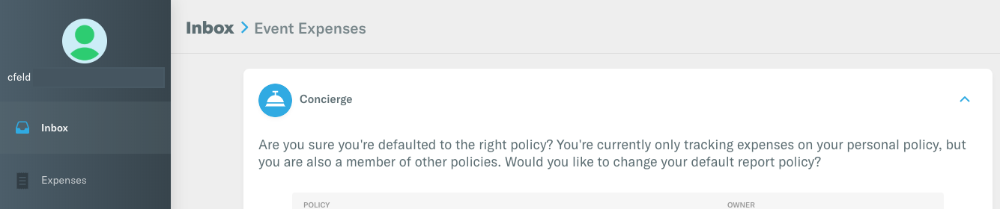
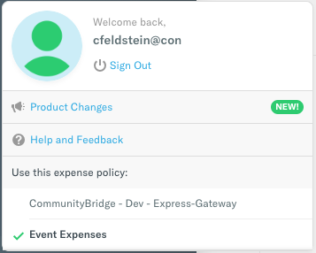

# Docs Source : .Get Reimbursed vInitial

Beneficiaries submit their requests for project-related business expenses for reimbursement through Expensify. Then reviews of the outgoing funds \(organization invoices, expenses paid, and so on\) occur in the following order:

1. The project administrator or event organizer validates and approves or rejects the expenses.
2. Linux Foundation personnel review, administer, and process all requests for expenditures to ensure oversight for use of the donated funds. Reported expenses must align to the specific expense policy and are controlled through the policy. For example, the policy might state a hotel price range that is acceptable for contributors or a per diem food allowance. The Linux Foundation approves or rejects the reimbursement.

All expense and claim payments appear in the project's public ledger \(transaction list\). Full transparency lets anyone see how funds are spent.

/\*&lt;!\[CDATA\[\*/  
div.rbtoc1573736617741 {padding: 0px;}  
div.rbtoc1573736617741 ul {list-style: disc;margin-left: 0px;}  
div.rbtoc1573736617741 li {margin-left: 0px;padding-left: 0px;}  
  
/\*\]\]&gt;\*/

* [Prepare for Reimbursement](docs-source-.get-reimbursed-vinitial.md#id-.GetReimbursedvInitial-PrepareforReimbursement)
* [Set Up a Reimbursement Account in Expensify](docs-source-.get-reimbursed-vinitial.md#id-.GetReimbursedvInitial-SetUpaReimbursementAccountinExpensify)
* [Create and Submit an Expense Report](docs-source-.get-reimbursed-vinitial.md#id-.GetReimbursedvInitial-CreateandSubmitanExpenseReport)

## Prepare for Reimbursement 

Consider the following financial aspects of reimbursement before you make a request:

* The Linux Foundation issues tax forms like a 1099 form \(and equivalent forms for Europe\) through CommunityBridge Funding. Although the Linux Foundation cannot provide you with legal or tax advice, you may need to use these forms in connection with your own tax reporting obligations.
* CommunityBridge Funding uses Expensify, a third-party expense management and payment application. Expensify is an online service application that lets you link your reimbursement account and generate expense reports. After an expense report or invoice is reimbursed through that application, it is synchronized with CommunityBridge to provide full transparency.

Have these items handy before you begin:

* Receipts for the expenses that you want to submit for reimbursement
* The Expensify policy invitation email that you received from CommunityBridge 

## Set Up a Reimbursement Account in Expensify 

You set up an Expensify account and link it to a bank or financial service account to receive reimbursements.

Important:

Linux Foundation requires that international \(non-U.S.\) individuals use a bank account and a wire transfer.

As a beneficiary, you receive an invitation email from the Expensify Concierge informing you that you have access to the CommunityBridge project policy. Use your email address to sign in to Expensify.

**Do these steps:**

1. Go to the Expensify website: [https://www.expensify.com/signin](https://www.expensify.com/signin)
2. Click **Email**, enter your email address, and click **Next**. Be sure to use the same email address that the Expensify Concierge used to send you the invitation. 
3. Enter your password and click **Next**. Your Expensify Inbox appears. 
4. Depending on your location:
   * United States: Set up your Expensify reimbursement account: [Add a United States deposit account](https://docs.expensify.com/en/articles/2931-add-a-deposit-account-united-states).
   * International: Use a bank account and a wire transfer.

## Create and Submit an Expense Report 

Record expenses in a report to submit them to the project administrator and the Linux Foundation for reimbursement.

**Tip:** Click your **profile** and then select an **expense policy** to use as the default for your expense reports, for example:

**Do these steps:**

1. Sign In to Expensify.
2. Follow the [Expensify procedures](https://docs.expensify.com/en/articles/2921-report-actions-create-submit-and-close) for creating and submitting an expense report. After you submit your report, the approver receives an email notification that your report requires attention. The approver reviews your reimbursement request and approves or rejects it. Next, a Linux Foundation administrator validates the eligible expenses, checks the fund balance, and approves or rejects the reimbursement. Expensify funds your account.
3. Upon notification, go to your account to access your reimbursement money. 3-5 business days may be required for the funds to be deposited in your account.

