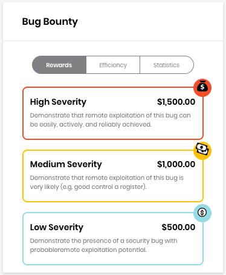
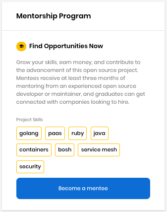
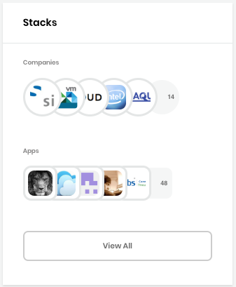
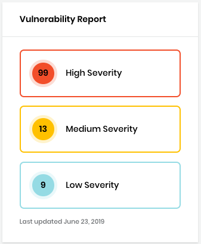
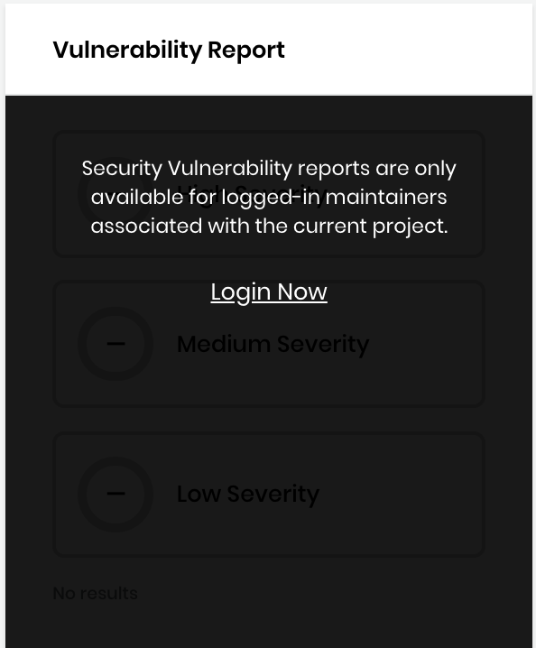

# Docs Source : .Integrated Services for a Project vInitial

Integrated services for a project let you see additional information about a project.

**Note:** Integrated services are not available for Events.

**Do these steps:**

1. Open [CommunityBridge Funding](https://funding.communitybridge.org/). 
2. Select **Projects and Mentorships**.
3. Browse the projects and click a **project** of interest. The Dashboard shows the services of the project, which can help you gain insight into the project. Funding integrates with the following independent CommunityBridge services: /\*&lt;!\[CDATA\[\*/ div.rbtoc1573736616074 {padding: 0px;} div.rbtoc1573736616074 ul {list-style: disc;margin-left: 0px;} div.rbtoc1573736616074 li {margin-left: 0px;padding-left: 0px;}  /\*\]\]&gt;\*/
   * [Bug Bounty](docs-source-.integrated-services-for-a-project-vinitial.md#id-.IntegratedServicesforaProjectvInitial-BugBounty)
   * [Mentorship Program](docs-source-.integrated-services-for-a-project-vinitial.md#id-.IntegratedServicesforaProjectvInitial-MentorshipProgram)
   * [Stacks](docs-source-.integrated-services-for-a-project-vinitial.md#id-.IntegratedServicesforaProjectvInitial-Stacks)
   * [Vulnerability Detection](docs-source-.integrated-services-for-a-project-vinitial.md#id-.IntegratedServicesforaProjectvInitial-VulnerabilityDetection)

## Bug Bounty 

**Bug Bounty** shows the dollar compensation for reported bugs or vulnerabilities by software developers. Many developers discover and resolve bugs on their own—a bug bounty program compensates these developers for their contributions. Projects can allocate funds for running a bug bounty program, and hackers all around the world can submit real-world reproducible bugs that are validated for authenticity. You can see the metrics around program details, bounty amounts, bugs detected, and hackers paid, and so on. Anyone can view publicly disclosed bug overviews for the project, but maintainers have privileged access to the detailed full disclosure information. Include a bug bounty service to provide replicable defects as well as a backlog of actionable data that maintainers can easily use to improve the security and robustness of their projects.

## Mentorship Program 

The **Mentorship** **Program** provides a mentorship matchmaking service that helps grow interested individuals into participating contributors in open source communities. This program connects mentorship candidates with projects; mentees with mentors; projects with donors to provide mentorship stipends; and mentorship graduates with potential job opportunities.

## Stacks 

**Stacks** shows Security - Usage Metrics which let you see what companies and users support any project that joins CommunityBridge. These metrics show the total number of companies and users, and their company logos and profile images, respectively. Stacks provides crowd-sourced usage metrics about the project. These metrics include company and individual apps the project uses as part of their stack. This information is gathered from users who have voluntarily produced confirmation of the use within their private enterprise or public community environments. Although there is no concrete guarantee of this data being accurate due to the voluntary nature of it, Stacks does provide indicators to funders about the adoption of the project and its impact across the industry at large.

## Vulnerability Detection 

**Vulnerability Detection** provides a scanning service to detect vulnerabilities in your projects.

<table>
  <thead>
    <tr>
      <th style="text-align:left">
        
The Vulnerability Report shows the severity of vulnerabilities discovered
          in your project repositories. The National Vulnerability Database (NVD)
          provides CVSS scores for almost all known vulnerabilities. Vulnerabilities
          are classified into HIGH/MEDIUM/LOW severity for easy prioritization.

        

          
        

      </th>
      <th style="text-align:left">
        
Project maintainers can mouse over a <b>severity level</b> to log in to
          Vulnerability Detection and see upstream dependencies, security vulnerabilities,
          usage reports, and licensing details.

        

          
        

      </th>
    </tr>
  </thead>
  <tbody></tbody>
</table>