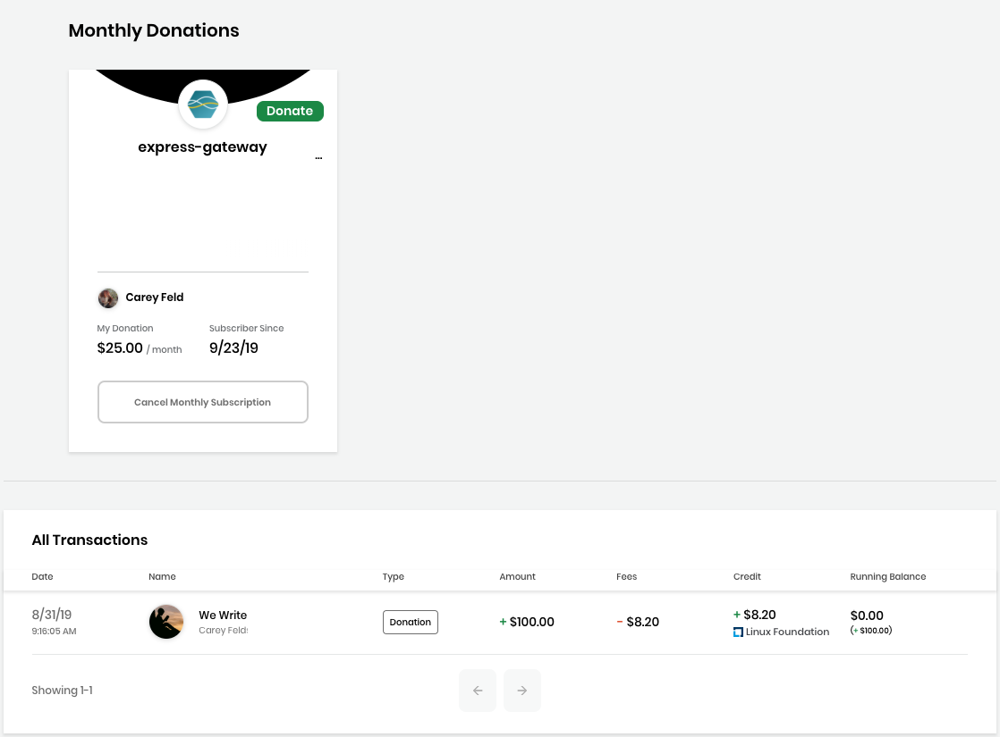
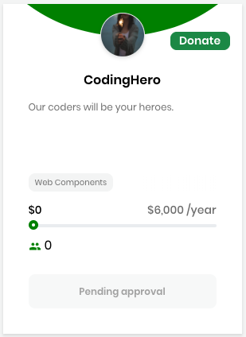
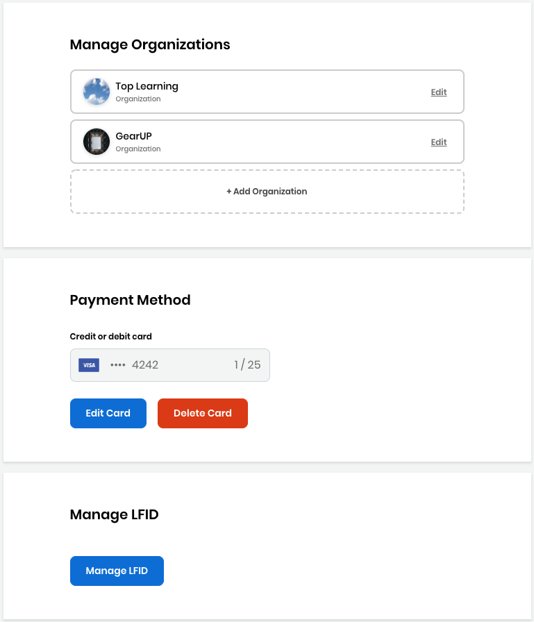
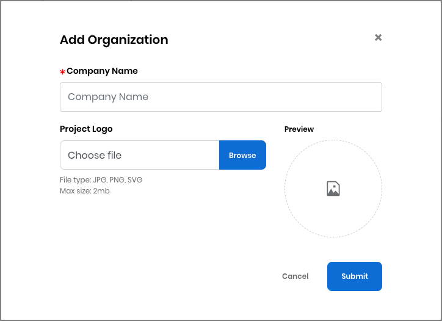
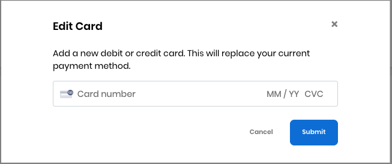
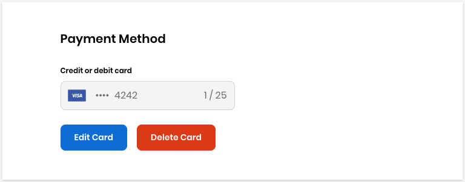

# Docs Source : .Manage Your Funding Account vInitial

You can manage your CommunityBridge Funding account, for example to view a record of all your transactions or to modify your monthly donations.

**Do these steps:**

1. Log in to CommunityBridge Funding.
2. Go to your user account  and select an **option** from the drop-down list: /\*&lt;!\[CDATA\[\*/ div.rbtoc1573736617603 {padding: 0px;} div.rbtoc1573736617603 ul {list-style: disc;margin-left: 0px;} div.rbtoc1573736617603 li {margin-left: 0px;padding-left: 0px;}  /\*\]\]&gt;\*/
   * [My Transactions](docs-source-.manage-your-funding-account-vinitial.md#id-.ManageYourFundingAccountvInitial-MyTransactions)
   * [My Projects](docs-source-.manage-your-funding-account-vinitial.md#id-.ManageYourFundingAccountvInitial-MyProjects)
   * [My Profile](docs-source-.manage-your-funding-account-vinitial.md#id-.ManageYourFundingAccountvInitial-MyProfile)
   * [Log Out](docs-source-.manage-your-funding-account-vinitial.md#id-.ManageYourFundingAccountvInitial-LogOut)

## My Transactions 

My Transactions shows your monthly donations and lists all your transactions with details.

* Click **Cancel Monthly Subscription** on a project to cancel your donation subscription. Click **Yes, cancel subscription** on the confirmation dialog that appears.
* Click **Discover projects** to go to the Projects page. This option appears when you do not have any Monthly Donations.

## My Projects 

My Projects lets you see all the projects and funds that you maintain all in one place: My Projects, My Events, and My Travel Scholarships. You can see the status of a project such as "Pending approval" and:

Click **View Project**/**entity** to see the fund details.

Click **Edit Project**/**Event/Scholarship** to edit the fund details.

## My Profile 

**My Profile** lets you manage your organization, payment method, and Linux Foundation identity account.

**Manage Organization** lets you add or edit your organization. Click **+ Add Organization** to add an organization.

**Payment Method** lets you add or change your credit or debit card provider and number.

Click **Add Card** to add your card details.

Click **Edit Card** or **Delete Card** to edit or delete an existing payment method, respectively.

**Manage LFID** opens your Linux Foundation account details, and lets you edit settings such as adding an avatar or more email addresses. Click **Manage LFID** to log in and open your account details. After you edit your account, click **Save**.

## Log Out 

Select **Log Out** from the drop-down list.

The user account icon is replaced with **Log In**.

