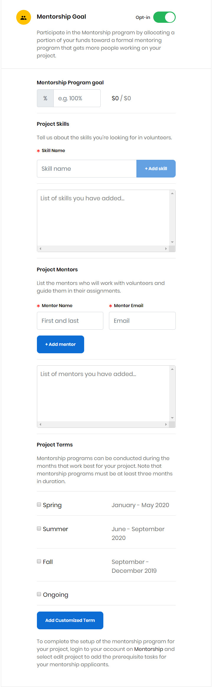

# Docs Source : .Opt In Your Project to the Mentorship Program vInitial

**Note:** The Mentorship program does not apply to Events.

While applying for funding or when you edit a project, the project application form lets you opt in to the Mentorship program and allocate funds for it. After your project is approved, it is available in:

* [CommunityBridge Mentorship](https://people.communitybridge.org/) for Mentorship program participants
* [CommunityBridge Funding](https://funding.communitybridge.org/) for individuals and organizations to donate, and for individuals to apply as a mentee

**Do these steps:**

1. Submit an application for a project or edit your project. For details, see [Apply for Funding](docs-source-.apply-for-funding-vinitial.md).  
2. In the [Project Application](docs-source-.project-application-vinitial.md) form, under the Fund Distribution section, **Opt-in** to the Mentorship Goal and complete the fields that appear.    
3. In the **Mentorship Program goal**  field, type a value. It is the percentage of the total project funds that you want to allocate towards the program. For example, if your goal is $120K to sponsor 20 mentees and you have raised $72K, you have met 60 percent of your goal. This amount appears in your Project Goals and Goals Breakdown in your project Dashboard.  
4. Click in the **Skills Name** field to open a list of skills to choose from. Select the skill and Click **+ Add** **skill** to add skills.  
5. Under **Project Mentors**, provide the names and email addresses of individuals who you want to invite to be mentors. These individuals receive email invitations to the Mentorship program from the Linux Foundation. Click **+ Add** **mentor** to add mentors.  
6. Under **Project Terms,** select a checkbox to select a term. Click **Add Customized Term** if you want to set the start date and end date of a term that is not specified in the available terms.  
7. Click **Submit Application**. Prospective mentors are sent an email inviting them to participate in the Mentorship program. After your project accepts mentees, [Set Up Stipends](docs-source-.set-up-a-stipend-for-a-mentee-vinitial.md).

