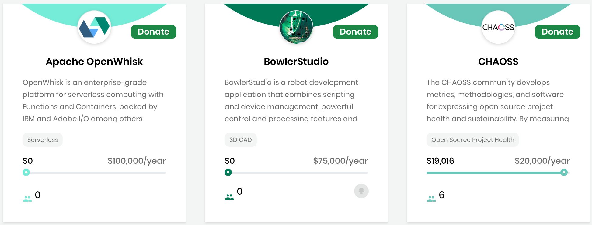
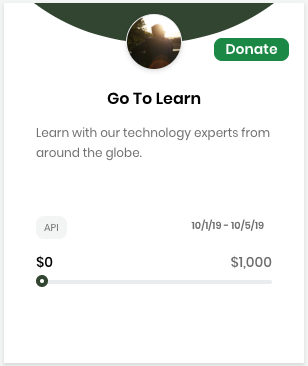

# Docs Source : .Overview vInitial

When you are interested in crowdfunding, CommunityBridge Funding lets you discover projects, events, travel scholarships, and get involved in donating or sponsoring for projects, events, and travel scholarships..

**Get started:**

1. Open CommunityBridge Funding. Projects and Mentorships appear by default.
2. Select a **tab**: /\*&lt;!\[CDATA\[\*/ div.rbtoc1573736615586 {padding: 0px;} div.rbtoc1573736615586 ul {list-style: disc;margin-left: 0px;} div.rbtoc1573736615586 li {margin-left: 0px;padding-left: 0px;}  /\*\]\]&gt;\*/
   * [Projects and Mentorships ](docs-source-.overview-vinitial.md#id-.OverviewvInitial-ProjectsandMentorships)
   * [Events](docs-source-.overview-vinitial.md#id-.OverviewvInitial-Events)
   * [Travel Scholarships](docs-source-.overview-vinitial.md#id-.OverviewvInitial-TravelScholarships)
3. Browse or search the funds and learn more: 
   * [Projects and Mentorships](docs-source-.projects-and-mentorships-vinitial.md)
   * [Events](docs-source-.events-vinitial.md)
   * [Travel Scholarships](docs-source-.travel-scholarships-vinitial.md)
   * [Integrated Services for a Project](docs-source-.integrated-services-for-a-project-vinitial.md)
   * [Search](docs-source-.search-vinitial.md)
   * [Toggle Between Funding and Mentorship for a Project](docs-source-.toggle-between-funding-and-mentorship-for-a-project-vinitial.md)
4. \(Optional\) [Donate/Sponsor](docs-source-.donate-sponsor-vinitial.md).

## Projects and Mentorships  

**Projects and Mentorships** \(the default selection\) lists GitHub and Git projects, and projects that support the Mentorship program. Project overview information appears such as the number of backers and the CII badgefor a participant in the [Core Infrastructure Initiative \(CII\) Badge Program](https://www.coreinfrastructure.org/programs/badge-program/). The color of the badge represents the CII status. For each project, a bar shows the donation progress towards the total annual funding goal. **Donate** lets you donate funds to a project that you want to support.  

## Events 

**Events** lists events such as forums or conferences. Event funds can benefit and reimburse organizers for event expenses such as for a venue or food. For each event, a bar shows the donation progress towards the total annual funding goal, and the event beginning and end dates. **Sponsor** lets you donate funds to an event that you want to support. **Register** lets you register to attend the event.  

## Travel Scholarships 

**Travel Scholarships** lists funds for travel expenses, for example a scholarship to attend a women's conference. For each scholarship, a bar shows the donation progress towards the total annual funding goal. **Donate** lets you donate to a scholarship that you want to support.

