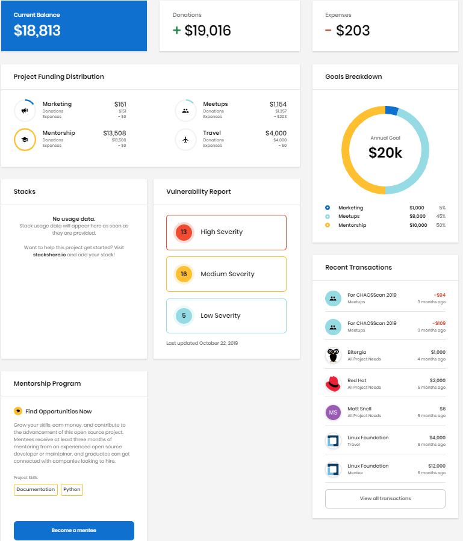
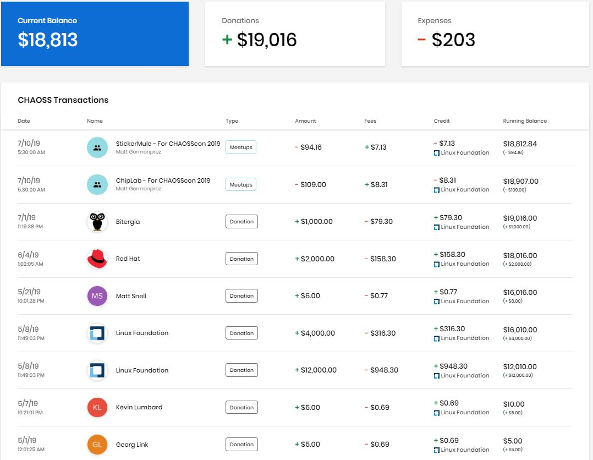

# Docs Source : .Projects and Mentorships vInitial

Projects and Mentorships details indicate how active a project is in the open source community. This information can help you decide what particular open source project to participate in or fund. You can also learn about the financial aspects of a project to see if you want to donate to it. A Dashboard shows information about funding such as how funds are distributed and what the funding goals are. CommunityBridge Funding maintains and displays a transparent ledger of incoming funds \(backer and sponsor transactions\) and outgoing funds \(developer invoices, expenses paid, and so on\) for each project. The Financial tab lists all these transactions with details so that the entire community can view receipts of expenses.

**Do these steps:**

1. Open [CommunityBridge Funding](https://funding.communitybridge.org/) 
2. From **Projects and Mentorships** tab, Click a **project** or **mentorship** of interest. 
3. Browse Dashboard for information. Click the **Financial** tab to see transaction details. **Note:** The Home screen shows the overview of the project. /\*&lt;!\[CDATA\[\*/ div.rbtoc1573736615737 {padding: 0px;} div.rbtoc1573736615737 ul {list-style: disc;margin-left: 0px;} div.rbtoc1573736615737 li {margin-left: 0px;padding-left: 0px;}  /\*\]\]&gt;\*/
   * [Overview](docs-source-.projects-and-mentorships-vinitial.md#id-.ProjectsandMentorshipsvInitial-Overview)
   * [Dashboard](docs-source-.projects-and-mentorships-vinitial.md#id-.ProjectsandMentorshipsvInitial-Dashboard)
   * [Financial](docs-source-.projects-and-mentorships-vinitial.md#id-.ProjectsandMentorshipsvInitial-Financial)

## Overview 

The overview shows some or all of the following items depending on the data that is available:

<table>
  <thead>
    <tr>
      <th style="text-align:left">Name</th>
      <th style="text-align:left">Description</th>
    </tr>
  </thead>
  <tbody>
    <tr>
      <td style="text-align:left">A bar shows the donation progress towards the total annual goal.</td>
      <td
      style="text-align:left"></td>
    </tr>
    <tr>
      <td style="text-align:left"><b>Current Balance</b>
      </td>
      <td style="text-align:left">The total amount of funds available in the account.</td>
    </tr>
    <tr>
      <td style="text-align:left"><b>Backers</b>
      </td>
      <td style="text-align:left">The number of individuals who have donated to the project. This number
        includes individual and organization donations by unique Linux Foundation
        accounts.
         The number of backers indicates the popularity and momentum of the project.</td>
    </tr>
    <tr>
      <td style="text-align:left"><b>Sponsor Organizations</b>
      </td>
      <td style="text-align:left">The logos of companies that sponsor the project.</td>
    </tr>
    <tr>
      <td style="text-align:left"><b>forks</b>
      </td>
      <td style="text-align:left">The number of repository copies. Forking a repository lets developers
        propose changes to another project or use another project as a starting
        point for an idea.</td>
    </tr>
    <tr>
      <td style="text-align:left"><b>stars</b>
      </td>
      <td style="text-align:left">The number of developers who saved the project repository to their list
        of Starred Repos.
         Stars indicate popularity in that developers like or want to follow a
        repository.</td>
    </tr>
    <tr>
      <td style="text-align:left"><b>issues</b>
      </td>
      <td style="text-align:left">The number of bugs, enhancements, or other requests in a repository. The
        number of issues can indicate the activity in a project.</td>
    </tr>
    <tr>
      <td style="text-align:left"><b>View Repository</b>
      </td>
      <td style="text-align:left">Opens the project repository in GitHub.</td>
    </tr>
    <tr>
      <td style="text-align:left"><b>View Site</b>
      </td>
      <td style="text-align:left">Opens the associated website.</td>
    </tr>
    <tr>
      <td style="text-align:left"><b>CII badge field</b> 
        
      </td>
      <td style="text-align:left">
        <ul>
          <li>Shows that the project is a participant in the <a href="https://www.coreinfrastructure.org/programs/badge-program/">Core Infrastructure Initiative (CII) Badge Program</a>.</li>
          <li>The color of the badge represents the CII status.</li>
          <li>The status is a &quot;tiered %&quot; field&#x2014;the field shows 300%
            for gold, 200% for silver, and 100% for passing, and adds progress after
            the highest-earned badge.</li>
          <li>A CII badge indicates that the project has self-certified that they follow
            best practices for secure open source development.</li>
          <li>Click the <b>badge field</b> to go the project&apos;s CII Best Practices
            page and view the CII details.</li>
        </ul>
      </td>
    </tr>
    <tr>
      <td style="text-align:left"><b>Code of Conduct</b>
      </td>
      <td style="text-align:left">
        <ul>
          <li>Shows the rules of behavior for the project.</li>
          <li>The Code of Conduct (CoC) identifies the standard behavior expected of
            their community &#x2014; and to protect those involved. A default <a href="https://www.contributor-covenant.org/version/1/4/code-of-conduct">Code of Conduct</a> opens
            when a project does not provide a specific one.</li>
        </ul>
      </td>
    </tr>
  </tbody>
</table>Following is an example of project overview:

## Dashboard 

Dashboard shows various aspects of the project.

| Name | Description |
| :--- | :--- |
| **Current Balance** | The total amount of funds available in the account. |
| **Donations** | The amount of money that has been donated to the project. |
| **Expenses** | The amount of money spent or costs incurred for the project, which indicate the cost of doing business. |
| **Project Funding Distribution** | Shows how project funds are distributed and their dollar amount |
| **Goals Breakdown** | Shows the annual financial goal and progress towards it by individual goal. |
| **Recent Transactions** | Lists recorded financial transactions in chronological order.  Click **View all transactions** to see a log of transactions. |

Funding integrates with independent CommunityBridge services:

* Mentorship Program
* Vulnerability Detection
* Stacks
* Bug Bounty \(not shown in the following example\)

You can see additional information about the projects from the above mentioned the integrated services. For more information, see [Integrated Services for a Project](docs-source-.integrated-services-for-a-project-vinitial.md).

Following is an example of project dashboard:

## Financial 

The Financial tab lists all transactions with details in chronological order. Following is an example of a project's financial report:

