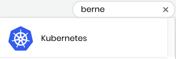

# Docs Source : .Search vInitial

Search field allows you to find a project, event, or travel scholarship. Your search looks for items _within_ the tab type. For example, after you select the Events tab, you can search for and find a specific event. If you search for an event when you have the Projects and Mentorships tab selected, a message informs you "Items not found."

**Do these steps:**

1. Select the **tab** for the type of item you want to locate: Projects and Mentorships, Events, or Travel Scholarships.  
2. Click in the Search field:    
3. Type a search term for the item you want to locate. You can search by name or part of a name, for example:   One or more results appear for the items that belong to the tab type.  
4. Click the item result you want, for example, click **Kubernetes**. The details for the item appear. Using this example, the Project Details for Kubernetes appear.

