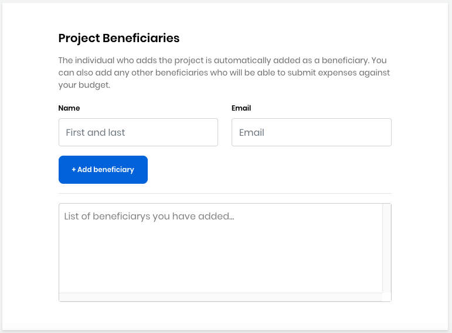

# Docs Source : .Set Up a Stipend for a Mentee vInitial

As a project administrator, you work with the Linux Foundation to set up stipends for your Mentorship program mentees. The amount raised in your project determines the maximum amount that is available for stipends. You set up stipends by adding mentees as beneficiaries in the project. Only you can add or remove beneficiaries. The Linux Foundation sets up individual Expensify accounts and collects the required tax forms such as W-9s or country-specific tax forms for each beneficiary \(mentee\). Each mentee receives an email that includes a link to their Expensify account, where they follow a workflow to [claim their stipend](docs-source-.get-reimbursed-vinitial.md). If you make beneficiary changes, the Linux Foundation is notified and adjusts the Expensify accounts accordingly.

While [applying for funding](docs-source-.add-a-git-project-vinitial.md), you can add names of mentees under the Project Beneficiaries section of [Project Application](docs-source-.project-application-vinitial.md). You can also add names of mentees at a later stage by editing your project. To add mentees:

**Do these steps:**

1. Log in to CommunityBridge Funding.  
2. Go to your account and select **My Projects** from the drop-down list.  
3. Click **Edit Project** on the project to which you want to add a beneficiary.  
4. Add each mentee \(beneficiary\) in the Project Beneficiaries section:    
5. Click **Save Changes**.

