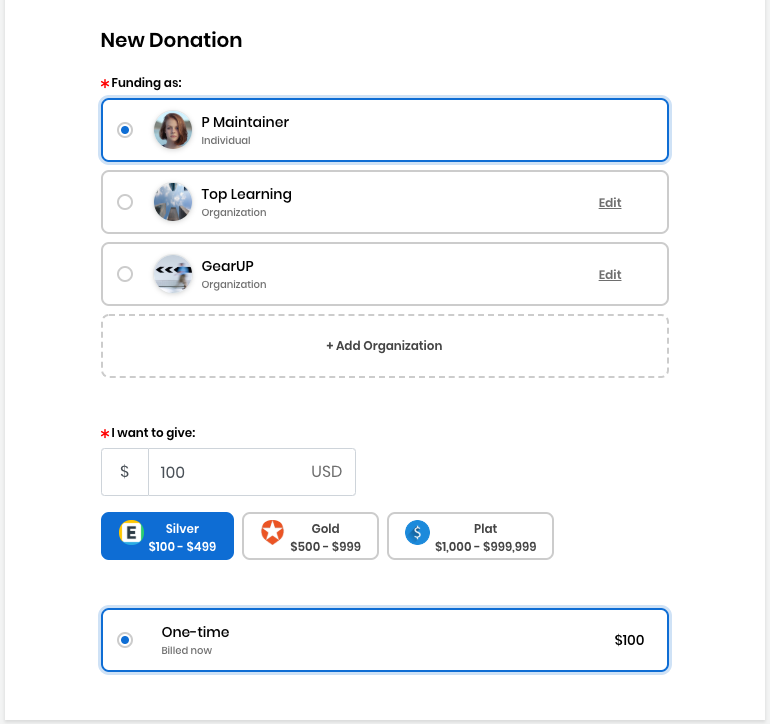
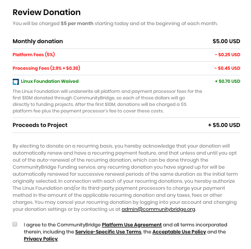

# Docs Source : .Sponsor Events vInitial

You can sponsor events and meetups, and the associated activities that you want to support. Track expenses in transparent public ledgers.

Keep these items ready before you begin:

* If you are donating as an organization, a logo file for your organization in JPG, PNG, SVG format with a maximum size of 2 MB
* If you are making a payment using an invoice, information such as account and routing numbers

**Do these steps:**

1. Open [CommunityBridge Funding](https://funding.communitybridge.org/).  
2. Select **Events** tab.  
3. Click **Sponsor** on an event of interest. You are prompted to log in if you have not already done so. The New Donation form appears, for example:    
4. Select **Individual** or an **Organization**. If you select **Organization,** you can [add, edit, or delete an organization](docs-source-.add-edit-or-delete-an-organization-vinitial.md) anytime.  
5. Click in the **I want to give** field and type a dollar amount or select a predefined dollar or sponsor option. The **One-time** donation frequency is enabled by default.  
6. For Payment Method, select **Credit or debit card** or **Invoice**.
   * The **Invoice** Payment Method is enabled only if you donate as an **Organization** and select **One-time**. 
   * **Credit or debit card** lets you add a default card or edit a default card to use for your donation payment. Click **Add Card** or **Edit Card** to add or edit a card, respectively. Enter your card details and click **Submit**.
   * **Invoice** lets you request an invoice from the Linux Foundation for your donation. Select **Invoice**. If you have a purchase order number, enter the number in the PO Number field that appears. If you want to request a purchase order number, contact your Linux Foundation administrator—the Finance team will contact you. The Finance team can work with your organization for other methods of payment such as checks.
7. Review your donation summary and your donation amounts in the Review Donation section. Notice the fee amounts and the amount that Linux Foundation waives. 
8. Select the checkbox— **I agree to the CommunityBridge** [**Platform Use Agreement**](https://communitybridge.dev.platform.linuxfoundation.org/platform-use-agreement) **and all terms incorporated therein, including the** [**Service-Specific Use Terms**](https://communitybridge.dev.platform.linuxfoundation.org/service-terms)**, the** [**Acceptable Use Policy** ](https://communitybridge.dev.platform.linuxfoundation.org/acceptable-use)**and the** [**Privacy Policy**](https://www.linuxfoundation.org/privacy/).
9. Click **Submit Sponsorship**. **Result:** Your Accounts page appears.

