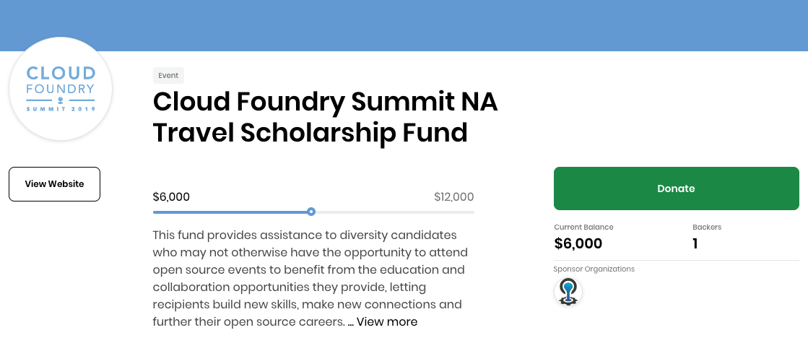
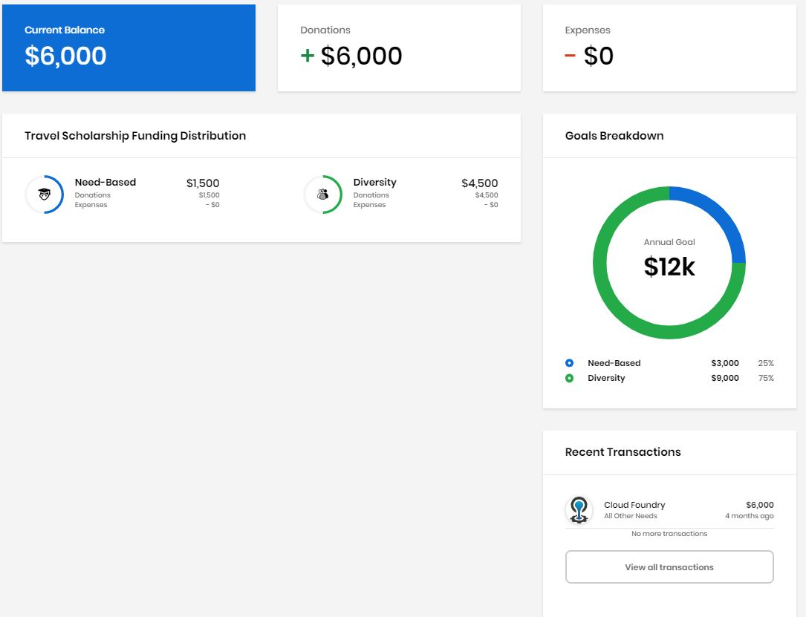
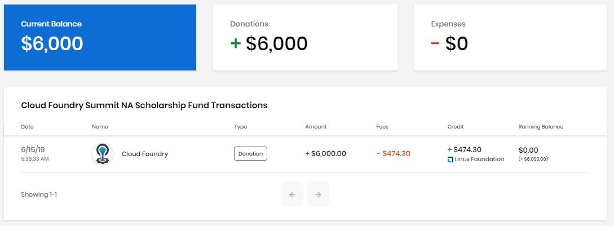

# Docs Source : .Travel Scholarships vInitial

You can find out about Travel Scholarships and donate to the ones that you want to support. Travel Scholarships provide financial assistance to need-based individuals for travel expenses such as to fly to a technical summit. A Dashboard shows high-level information about funding including how funds are distributed and what the funding goals are. CommunityBridge Funding also maintains and displays a transparent ledger of incoming funds \(backer and sponsor transactions\) and outgoing funds \(developer invoices, expenses paid, and so on\) for each Travel Scholarship. The Financial tab lists all these transactions with details so that the entire community can view receipts of expenses.

**Do these steps:**

1. Open  [CommunityBridge Funding](https://funding.communitybridge.org/). 
2. Select **Travel Scholarships**.
3. Click a **Travel Scholarship** of interest.
4. Browse Dashboard for more information. Click the **Financial** tab to see transaction details. **Note:** The Home screen shows the overview of the project. /\*&lt;!\[CDATA\[\*/ div.rbtoc1573736615961 {padding: 0px;} div.rbtoc1573736615961 ul {list-style: disc;margin-left: 0px;} div.rbtoc1573736615961 li {margin-left: 0px;padding-left: 0px;}  /\*\]\]&gt;\*/
   * [Overview](docs-source-.travel-scholarships-vinitial.md#id-.TravelScholarshipsvInitial-Overview)
   * [Dashboard](docs-source-.travel-scholarships-vinitial.md#id-.TravelScholarshipsvInitial-Dashboard)
   * [Financial](docs-source-.travel-scholarships-vinitial.md#id-.TravelScholarshipsvInitial-Financial)

## Overview 

The overview shows some or all of the following items depending on the data that is available.

| Name | Description |
| :--- | :--- |
| A bar shows the donation progress towards the total annual goal. |  |
| **Current Balance** | The total amount of funds available in the account. |
| **Backers**  | The number of individuals who have donated to the event. This number includes individual and organization donations by individual Linux Foundation accounts. The number of backers indicates the popularity and momentum of the event. |
| **Sponsor Organizations** | The logos for the companies that sponsor the project. |
| **Visit Website** | Opens the associated website. |

Following is an example of a Travel Scholarship overview:

## Dashboard 

The Dashboard shows various aspects of the fund depending on the data that is available.

| Name | Description |
| :--- | :--- |
| **Current Balance** | The total amount of funds available in the account. |
| **Donations** | The amount of money that has been donated to the project. |
| **Expenses**  | The amount of money spent or costs incurred for the project, which indicate the cost of doing business. |
| **Travel Scholarship Funding Distribution** | Shows how project funds are distributed and their dollar amount. |

Following is an example of a Travel Scholarship dashboard:

## Financial 

The Financial tab lists all transactions with details in chronological order. The following example shows a Travel Scholarship Financial tab:

